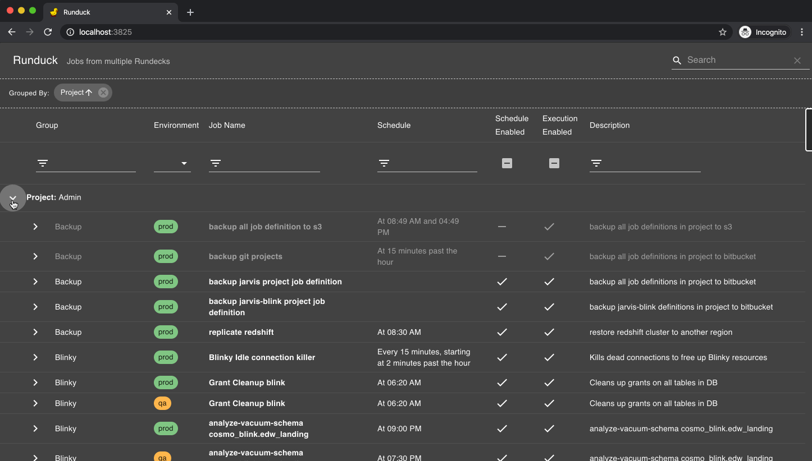
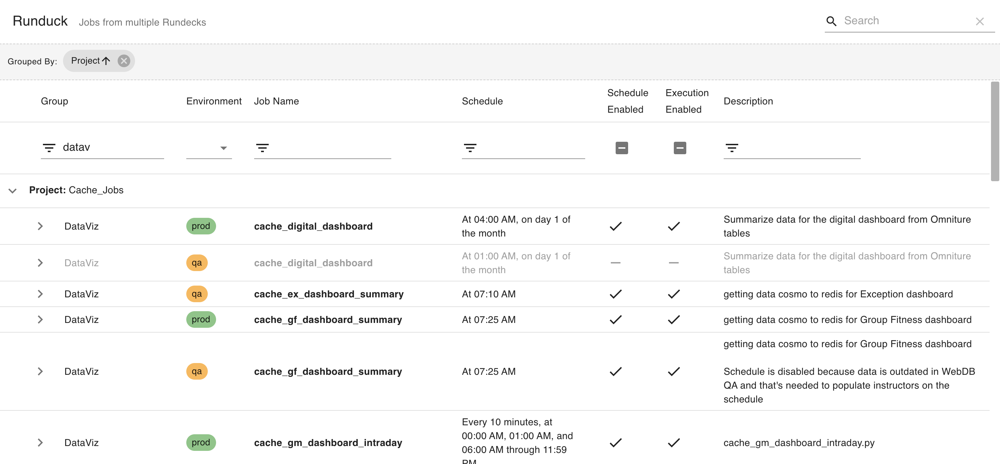

# Runduck

Runduck was created because documentation gets outdated and keeping track of jobs in different environments can be very tedious.

With Runduck you can see, compare and search information about jobs across different Rundeck environments.

Runduck reads the job configurations using the [Rundeck API](https://docs.rundeck.com/docs/api/rundeck-api.html) and caches it into Redis. It has an API that can be scheduled to update all the data at once periodically.

The UI also allows you to refresh the metadata for individual jobs on-demand.

Here's a quick demo:



It works with a light version depending on your settings:



## Configuration

Create an **app.cfg** file in the root folder.

1. Add the Redis connection settings
2. Obtain the Rundeck tokens to call the API for each environment (you can generate a token through the Rundeck UI)
3. Add the Rundeck environement settings like in the example below

#### app.cfg

```python
REDIS_HOST="localhost"
REDIS_PORT=6379
REDIS_INDEX=2

# Set up environments in order of priority for reporting
ENV={
    "prod": {
        "base_url": "http://devops.somedomain.com/rundeck",
        "authtoken": "********"
    },
    "stag": {
        "base_url": "http://stag-devops.somedomain.com/rundeck",
        "authtoken": "********"
    },
    "qa": {
        "base_url": "http://qa-devops.somedomain.com/rundeck",
        "authtoken": "********"
    },
    "test": {
        "base_url": "http://test-devops.somedomain.com/rundeck",
        "authtoken": "********"
    }
}
```

## Running Runduck

### Running locally

1. As a best practice, create a virtual environement:
`python3 -m venv venv` 
2. Activate the environment:
`source venv/bin/activate`
3. Install the requirements:
`pip install -r requirements.txt`
4. Running in development:
`python run.py`

### Docker

Replace `public_url` with the base url for the application (for the references to static files in the UI build)

```bash
docker image build . \
--build-arg aws_access_key_id=****** \
--build-arg aws_secret_access_key=****** \
--build-arg config_path=s3://********/runduck \
--build-arg public_url=http://localhost:3825
```

### Importing the Data

Use the /jobs/combine API to import the data:

```bash
curl -X POST "http://localhost:3825/api/jobs/combine?force_refresh=true"
```

You can see all the available API endpoints at http://localhost:3825/api/doc

## Stack

Runduck is written in Python3 and [Flask](https://flask.palletsprojects.com/). APIs created with [Flask-RESTPlus](https://flask-restplus.readthedocs.io/).
Data is cached into [Redis](https://redis.io/).

The UI was built using [React](https://reactjs.org/), [Typescript](https://www.typescriptlang.org/), [Material-UI](https://material-ui.com/) and [Material Table](https://material-table.com/).

The source code for the front-end is available in [Runduck-UI](https://github.com/Bubbassauro/runduck-ui). At the moment there isn't an elegant build process, so the packaged files are included in this repo.
